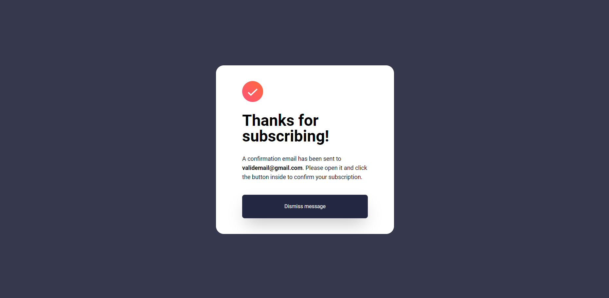
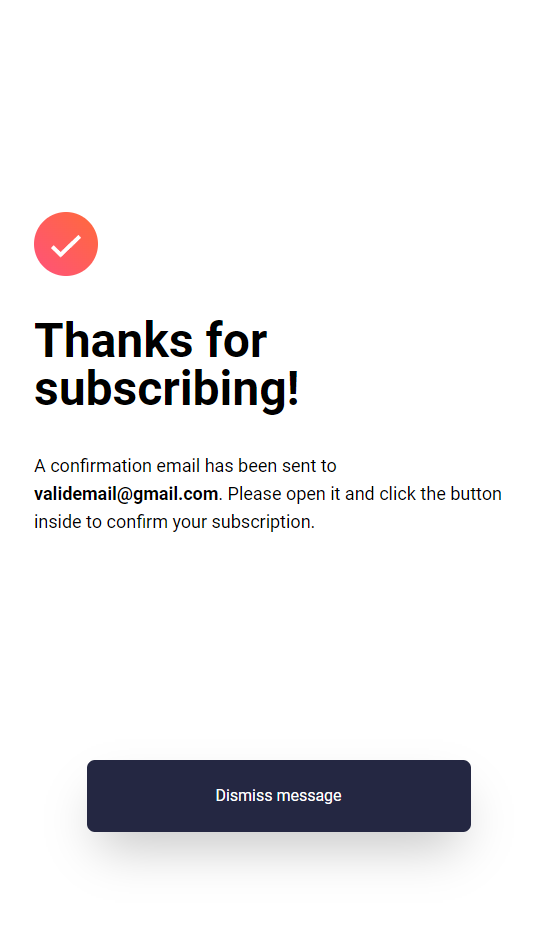

# Frontend Mentor - Newsletter sign-up form with success message solution

## Table of contents

- [Overview](#overview)
  - [The challenge](#the-challenge)
  - [Screenshot](#screenshot)
  - [Links](#links)
- [My process](#my-process)
  - [Built with](#built-with)
  - [What I learned](#what-i-learned)
  - [Continued development](#continued-development)
  - [Useful resources](#useful-resources)
- [Author](#author)

## Overview

### The challenge

Users should be able to:

- Add their email and submit the form
- See a success message with their email after successfully submitting the form
- See form validation messages if:
  - The field is left empty
  - The email address is not formatted correctly
- View the optimal layout for the interface depending on their device's screen size
- See hover and focus states for all interactive elements on the page

### Screenshots

- Desktop Normal

  

- Desktop Default

  

- Desktop Success

  

- Mobile Normal

  

- Mobile Success
  

### Links

- Solution URL: [Newsletter sign-up form with success message](https://github.com/ei-abdullah/newsletter-sign-up-form)
- Live Site URL: [Abdullah Zafar | Newsletter sign-up form with success message](https://ei-abdullah.github.io/newsletter-sign-up-form/)

## My process

### Built with

- Semantic HTML5 markup
- Flexbox
- [TailwindCSS](https://tailwindcss.com/)

### What I learned

- TailwindCSS: This is my first TailwindCSS project and through this project, I improved my tailwindcss skills and created beautiful and responsive design in way less than time than I would do using CSS.

- JavaScript: In this project, I execute regular expressions which I have learned couple weeks age. It is due to regExp, I was able to handle form without writing unnecessary conditional statements.

```js
 const email = emailInput.value;
  const emailPattern = /^[^\s@]+@[^\s@]+\.[^\s@]+$/;

  if (emailPattern.test(email)) {
    novalidEmail.classList.add("hidden");
    window.location.href = `./src/subscribing-page.html?email=${encodeURIComponent(
      email
    )}`;
  } else {
    novalidEmail.classList.remove("hidden");
  }
};
```

### Continued development

In my future journey, I aim to enhance my skills by mastering CSS and JavaScript frameworks such as TailwindCSS and ReactJS. My goal is to create exceptional, responsive, and highly functional web applications.

### Useful resources

- [TailwindCSS documentation](https://tailwindcss.com/docs/installation) - To get going for TailwindCSS, I used their documentation.

## Author

- Frontend Mentor - [@ei-abdullah](https://www.frontendmentor.io/profile/ei-abdullah)
- LinkedIn - [@eiabdullah](https://www.linkedin.com/in/eiabdullah/)
- GitHub - [@ei-abdullah](https://github.com/ei-abdullah)
